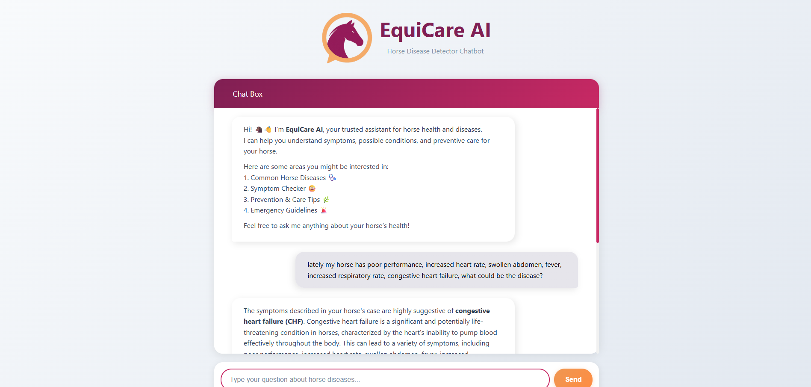

<div align="center">
    
</div>

<br>
<h1 align="center">EquiCare AI</h1>
<br>

EquiCare-AI is a **chatbot powered by Retrieval-Augmented Generation (RAG)** designed to assist with horse disease knowledge and management.  
The dataset comes from [HorseDVM](https://horsedvm.com/views/health.php), a website that contains hundreds of horse diseases with detailed explanations.  
I scraped the data and converted it into documents for retrieval.  

This project is implemented as a **Flask application** with a user-friendly chatbot UI, making it easy to ask questions about horse health.  

For the RAG system, two HuggingFace models are used:  
- **Embedding model**: `sentence-transformers/all-MiniLM-L6-v2`  
- **Text generation model**: `tiiuae/Falcon3-1B-Instruct`  

Both models were run **locally**, so they are lightweight and may not provide the strongest performance.  
If you want more powerful results, feel free to experiment with larger models.  
All model configurations can be adjusted in [`src/utils/model_config.py`](src/utils/model_config.py).  

---

## 📊 Data Source

The primary data source is **HorseDVM**, which provides extensive coverage of horse diseases, symptoms, treatments, and preventive care.  
This data was scraped using [`src/scraping.py`](src/scraping.py).  

The script generates two files:  
1. `data/horse_diseases_docs.json` → JSON file used as the RAG document source.  
2. `data/horse_diseases.csv` → CSV file for inspection or direct data analysis.  

---

## ⚙️ Setup Instructions

1. **Clone this repository**  
   ```bash
   git clone https://github.com/YusufSyam/EquiCare-AI
   cd EquiCare-AI
   ```

2. **Create a virtual environment & install dependencies**

   ```bash
   python -m venv venv
   source venv/bin/activate   # for Linux/Mac
   venv\Scripts\activate      # for Windows

   pip install -r requirements.txt
   ```

   > ⚠️ Note: This project was developed on **Python 3.13.2**.
   > Using a different version may cause different results.

3. **Scrape data from HorseDVM**

   Go to the `src` directory and run:

   ```bash
   cd src
   python scraping.py
   ```

   This will generate both the JSON and CSV datasets.

   > You can skip this step because both files are already included in the repo (they are small in size).

4. **Build Chroma vector database**

   ```bash
   python load_chroma.py
   ```

   This will load documents from `data/horse_diseases_docs.json` and persist them into `data/chroma_db/`.

   > You only need to run `scraping.py` and `load_chroma.py` once, unless the dataset is updated.

5. **(Optional) Test the RAG pipeline**

   ```bash
   python rag_pipeline.py
   ```

   On the first run, this will download the text generation model `tiiuae/Falcon3-1B-Instruct`.
   ⚠️ Warning: this model is large (~4GB), so make sure you have enough disk space.
   Cached models are stored in your system’s HuggingFace cache (commonly under `C:\Users\<user>\.cache\huggingface` on Windows).

6. **(Optional) Enable GPU for faster inference**

   The project automatically uses GPU if available (`device_map="auto"`).

   To check GPU availability, run:

   ```bash
   python test_gpu_availability.py
   ```

   Expected output:

   ```
   True
   1
   NVIDIA GeForce RTX 4050 Laptop GPU
   ```

   If the first two lines don’t match, you need to:

   * Install CUDA toolkit: [NVIDIA CUDA Archive](https://developer.nvidia.com/cuda-toolkit-archive)
   * Reinstall PyTorch for your CUDA version: [PyTorch Install Guide](https://pytorch.org/get-started/locally/)

   Example (In my case i have CUDA 12.8):

   ```bash
   pip install torch --index-url https://download.pytorch.org/whl/cu128
   ```

   After reinstalling, re-run `test_gpu_availability.py` and confirm GPU is detected.

7. **Run the Flask app**

   Go back to the main directory and run:

   ```bash
   python app.py
   ```

   This will start the development server at:
   👉 [http://127.0.0.1:5000](http://127.0.0.1:5000)

   Open it in your browser.
   You’ll see a chatbot-like interface where you can type questions directly.

   

---

## 📝 Additional Notes

* **Model configuration**

  You can switch to lighter or heavier models in [`src/utils/model_config.py`](src/utils/model_config.py).
  Examples:

  * Lighter: `distilgpt2`
  * More powerful: `meta-llama/Llama-2-7b-chat-hf`

  > ⚠️ Some models are *gated*, meaning you’ll need to log in with HuggingFace CLI.

  You can also configure:

  * `embedding_model_name`
  * `max_new_tokens`
  * `k` (number of chunks retrieved from the vector DB)

* **Prompt template**
  Stored in [`src/utils/string_constants.py`](src/utils/string_constants.py).
  Feel free to modify it for better performance.

* **Limitations**  
  - Input and output are expected to be in English
  - The chatbot does not remember past interactions to generate contextual responses. Each interaction is **stateless** and independent.  
  - All chat history (`session['chat_history']`) is stored in the client-side browser cookie. This means that every time the application restarts, previous chat history is cleared to save cookie storage space.

* **Local Machine Specs**  
  The following hardware was used to run the models locally:  
  - **Processor:** 13th Gen Intel(R) Core(TM) i5-13450HX (16 CPUs), ~2.4GHz  
  - **GPU:** NVIDIA GeForce RTX 4050 Laptop GPU (6 GB VRAM)  
  - **RAM:** 12 GB  

  With these specs, each inference typically takes around **5–60 seconds**. If you find the current models too heavy or too weak, experiment with different HuggingFace models. Everything is modular and configurable, so adapting this system for your own needs should be straightforward.

<!-- 
* **Benchmarking**
  Testing and evaluation results are still pending.
  Current placeholder score: **X**
  For detailed reports and future benchmarks, see the `test_report/` folder. -->

* **Closing note**
Thank you for checking out this project. This project is a submission for data scientist technical test at NoLimit Indonesia and is still a work in progress and open for improvements, so any kind of feedback, suggestions, or contributions are warmly welcome. If you have any questions, feel free to reach out to me (muhyusufsyamsyam@gmail.com). 


